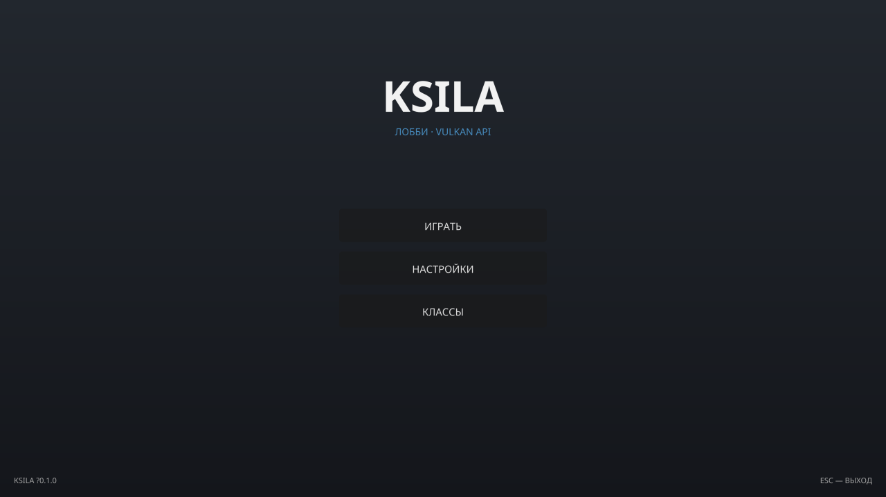

# Ksila — лобби на Vulkan API

Простое игровое лобби на **чистом Vulkan API** (без движка Godot) с кнопками в
стиле дефолтной темы Godot 4: **Играть**, **Настройки**, **Классы**.



## Что внутри

- **Vulkan 1.0** — окно (GLFW), свопчейн, один графический пайплайн, push-константы,
  4× MSAA (если поддерживается), пересоздание свопчейна при ресайзе, опциональные
  validation layers (`--validate`).
- **UI без движка** — собственный draw list (текстурированные треугольники),
  растровые скругления как у Godot `StyleBoxFlat`, шейдерный текст из атласа.
- **Стиль Godot** — все визуальные константы кнопок взяты из дефолтной темы
  Godot 4 (`scene/theme/default_theme.cpp`):

  | Элемент | Значение Godot 4 |
  |---|---|
  | Фон кнопки (normal) | `rgba(0.1, 0.1, 0.1, 0.6)` |
  | Фон кнопки (hover) | `rgba(0.225, 0.225, 0.225, 0.6)` |
  | Фон кнопки (pressed) | `rgba(0, 0, 0, 0.6)` |
  | Рамка фокуса | 2 px, `rgba(1, 1, 1, 0.75)`, без заливки |
  | Цвет текста | `0.875` / `0.95` (hover) / `1.0` (pressed) |
  | Радиус углов | 3 px, детализация `min(ceil(1.5·r), 6)` |
  | Акцент | Godot Blue `#478cbf` |

- **Шрифт Noto Sans** (дефолтный шрифт Godot 4) с полной кириллицей, запекается
  в атлас через `stb_truetype` при старте.

## Сборка

Нужны: CMake ≥ 3.16, компилятор C++17, Python 3, Vulkan SDK (заголовки +
загрузчик `libvulkan`).

GLFW подхватится системный (`libglfw3-dev`), а если его нет — скачается и
соберётся автоматически (нужен `git`).

### Linux

```bash
# Debian/Ubuntu
sudo apt install libvulkan-dev libglfw3-dev glslang-tools  # glslang-tools опционален
cmake -B build -DCMAKE_BUILD_TYPE=Release
cmake --build build
./build/ksila
```

### Windows

Установите [Vulkan SDK](https://vulkan.lunarg.com/) и GLFW (или положите его
рядом), затем:

```bat
cmake -B build
cmake --build build --config Release
build\Release\ksila.exe
```

### Опции

- `--width N --height N` — размер окна (по умолчанию 1280×720)
- `--validate` — включить Vulkan validation layers
- `--help` — справка

### CMake-флаги

- `KSILA_PREBUILT_SHADERS=ON` — всегда использовать готовые SPIR-V из
  `shaders/prebuilt/` (не требует glslc/glslangValidator)
- `KSILA_GLFW_NULL=ON` — собрать GLFW в headless-режиме (без X11/Wayland;
  окно не откроется, полезно только для сборки)

## Android (APK)

Приложение собирается в CI в APK **без единой строчки Java** — NativeActivity
(`android.app.NativeActivity`, `hasCode="false"`) + Vulkan через
`VK_KHR_android_surface`. Тач работает как мышь, кнопка «Назад» — выход.

- **Скачать APK**: [Releases → lobby-latest](../../releases/tag/lobby-latest)
  (или артефакт `ksila-apk` в последнем запуске [Actions](../../actions))
- Требуется Android 7.0+ (API 24) с поддержкой Vulkan
- Внутри: `arm64-v8a` (все современные телефоны) + `x86_64` (эмуляторы)
- APK подписан debug-ключом из `android/signing/` (для Play Store нужен свой ключ)

Установка: скачайте `Ksila-lobby.apk`, откройте на телефоне и разрешите
установку из неизвестных источников. Или через adb:

```bash
adb install Ksila-lobby.apk
```

Локальная сборка APK (нужны Android SDK + NDK r26+, JDK 17):

```bash
cmake -B build-android -DCMAKE_BUILD_TYPE=Release \
  -DCMAKE_TOOLCHAIN_FILE="$ANDROID_HOME/ndk/26.3.11579264/build/cmake/android.toolchain.cmake" \
  -DANDROID_ABI=arm64-v8a -DANDROID_PLATFORM=android-24 -DKSILA_PREBUILT_SHADERS=ON
cmake --build build-android -j
bash tools/package_android_apk.sh --out Ksila-lobby.apk \
  "$(find build-android -name libksila.so -print -quit)=arm64-v8a"
```

## Управление

- **Мышь** — наведение и нажатие кнопок
- **Tab / ↑ / ↓ + Enter** — навигация с клавиатуры (с рамкой фокуса как в Godot)
- **Esc** — выход

## Инструменты

- `ksila-preview` — программный растеризатор того же UI без GPU:

```bash
./build/ksila-preview --hover 0 --out hover.png   # скриншот с hover на «Играть»
./build/ksila-preview --status 1 --out toast.png  # статус-сообщение «Настройки»
```

## Структура

```
src/
  main.cpp      — окно, ввод, главный цикл
  renderer.cpp  — Vulkan: свопчейн, пайплайн, атлас, отрисовка
  ui.cpp/.h     — draw list, шрифт, лобби (без зависимости от Vulkan)
shaders/        — GLSL-шейдеры (+ prebuilt SPIR-V)
tools/          — embed_binary.py, preview.cpp, png_probe.py
thirdparty/stb  — stb_truetype, stb_image_write (public domain)
assets/fonts/   — Noto Sans (SIL OFL 1.1)
```

## Лицензии

- Код — MIT (см. [LICENSE.txt](LICENSE.txt))
- Noto Sans — [SIL OFL 1.1](assets/fonts/OFL.txt)
- stb — public domain / MIT (см. [thirdparty/stb/LICENSE](thirdparty/stb/LICENSE))
